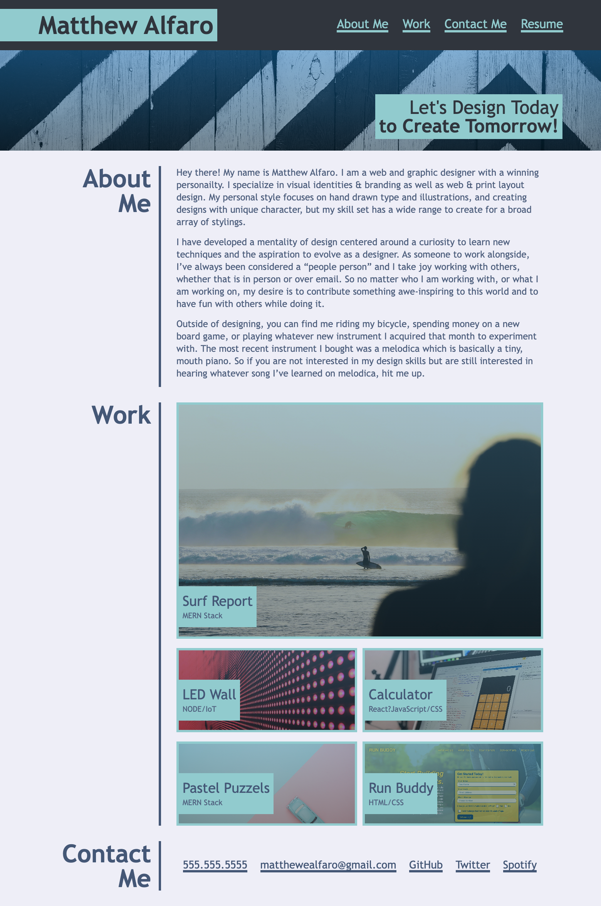

# Web Development Portfolio

Hello, my name is Matthew Alfaro and I am a student web developer. This site is a showcase to all of the projects I completed during my time spent in the UCF Web Development Bootcamp. This project did a lot to take the new and old knowledge I had about HTML and CSS and apply it practically. Through the completetion of this project, I have a deep understanding on how a developer produces a project with GitHub, how to make a website responsive, and how to lay a firm foundation with HTML that creates a more seamless CSS design process.

## How to View

Live URL Link:

https://alfaro-matttthew.github.io/web-development-portfolio/

GitHub Repo Link:

https://github.com/alfaro-matttthew/web-development-portfolio

## Screenshot

